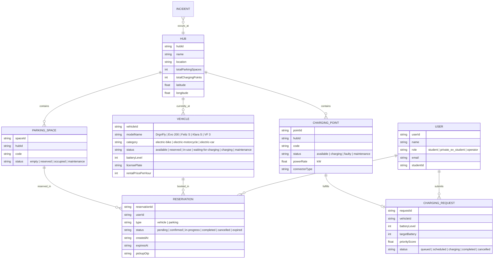

# HƯỚNG DẪN KỸ THUẬT & KIẾN TRÚC DỰ ÁN
## VINFAST SMART E-MOBILITY HUB (ĐHQG-HCM)

> **Tài liệu Kỹ thuật dành cho Lập trình viên & Nhóm Phát triển**  
> **Phiên bản:** 1.0.0  
> **Phạm vi:** Hệ thống Quản lý và Điều phối Mạng lưới Phương tiện Điện VinFast tại Khu đô thị ĐHQG-HCM kết nối Tuyến Metro Số 1.

---

## MỤC LỤC
1. [Tổng Quan Dự Án & Bối Cảnh Nghiệp Vụ](#1-tổng-quan-dự-án--bối-cảnh-nghiệp-vụ)
2. [Ngăn Xếp Công Nghệ (Tech Stack)](#2-ngăn-xếp-công-nghệ-tech-stack)
3. [Kiến Trúc Hệ Thống (System Architecture)](#3-kiến-trúc-hệ-thống-system-architecture)
4. [Cấu Trúc Thư Mục & Tổ Chức Mã Nguồn](#4-cấu-trúc-thư-mục--tổ-chức-mã-nguồn)
5. [Mô Hình Dữ Liệu Thực Thể (Data Models & Types)](#5-mô-hình-dữ-liệu-thực-thể-data-models--types)
6. [Quản Lý Trạng Thái & Logic Nghiệp Vụ Cốt Lõi (AppContext)](#6-quản-lý-trạng-thái--logic-nghiệp-vụ-cốt-lõi-appcontext)
7. [Các Luồng Nghiệp Vụ Chính (Core Business Workflows)](#7-các-luồng-nghiệp-vụ-chính-core-business-workflows)
   - 7.1. Luồng Xác thực & Phân quyền (Auth & Roles)
   - 7.2. Luồng Vòng đời Đặt, Nhận và Trả xe dùng chung (Shared EV Lifecycle)
   - 7.3. Luồng Đặt chỗ đỗ & Sạc xe cá nhân (Private EV Parking & Charging)
   - 7.4. Thuật toán Lập lịch sạc thông minh theo Độ ưu tiên (Smart Charging Scheduling)
   - 7.5. Động cơ Mô phỏng What-If & Điều phối Nhu cầu (Simulation Engine)
   - 7.6. Quy trình Quản lý Sự cố Hạ tầng (Incident Management)
   - 7.7. Bộ mô phỏng Thời gian thực (Real-time Clock Simulator)
8. [Ánh Xạ Kiểm Thử Tự Động & Kịch Bản Demo (TC-01 -> TC-12)](#8-ánh-xạ-kiểm-thử-tự-động--kịch-bản-demo-tc-01---tc-12)
9. [Hướng Dẫn Cài Đặt, Vận Hành & Mở Rộng Hệ Thống](#9-hướng-dẫn-cài-đặt-vận-hành--mở-rộng-hệ-thống)

---

## 1. TỔNG QUAN DỰ ÁN & BỐI CẢNH NGHIỆP VỤ

### 1.1. Bối cảnh
Dự án **VinFast Smart E-Mobility Hub** giải quyết bài toán giao thông vi mô (micro-mobility) xanh và kết nối dặm đầu - dặm cuối (first-mile / last-mile) cho sinh viên, giảng viên và cán bộ tại **Khu đô thị Đại học Quốc gia TP.HCM (VNU-HCM)**, đặc biệt kết nối trực tiếp với **Ga Metro Tuyến 1 (Bến Thành - Suối Tiên)**.

### 1.2. Mục tiêu hệ thống
1. **Dành cho Sinh viên sử dụng xe dùng chung (Shared EV Student):** Tra cứu vị trí các trạm Hub, tình trạng xe còn trống, đặt giữ chỗ xe trong 15 phút, nhận xe bằng mã OTP và trả xe tại bất kỳ trạm nào còn chỗ đậu.
2. **Dành cho Sinh viên có xe điện cá nhân (Private EV Student):** Đặt trước chỗ đỗ xe tại các Hub và đăng ký lịch sạc xe thông minh theo nhu cầu.
3. **Dành cho Đơn vị Vận hành (Operator / Quản trị viên):** 
   - Giám sát toàn mạng lưới (tổng số xe, trụ sạc, bãi đậu, tỷ lệ chiếm dụng - occupancy rate, cảnh báo quá tải >85%).
   - Tự động lập lịch sạc dựa trên mức pin và độ khẩn cấp.
   - Điều phối phương tiện (Rebalancing) giữa các Hub dư thừa xe sang Hub thiếu xe.
   - Chạy kịch bản giả định **What-If Simulation** (giờ cao điểm Metro, trạm sạc gặp sự cố) để chủ động đưa ra phương án phân bổ.
   - Tiếp nhận và giải quyết sự cố hạ tầng và xe điện.

---

## 2. NGĂN XẾP CÔNG NGHỆ (TECH STACK)

| Thành phần | Công nghệ / Thư viện | Vai trò |
| :--- | :--- | :--- |
| **Ngôn ngữ** | TypeScript 5.8+ | Bảo đảm type safety cho toàn bộ domain model và business logic |
| **Framework UI** | React 19 (React DOM 19) | Thư viện giao diện chính, render declarative với hiệu năng tối ưu |
| **Build Tool & Bundler** | Vite 8.3+ | Fast HMR dev server, tối ưu hoá bundling ES modules khi production |
| **Styling** | Tailwind CSS v4 (`@tailwindcss/vite`) | Utility-first CSS hiện đại, hỗ trợ Dark / Light mode toàn hệ thống |
| **Motion & Animation** | Motion (Framer Motion v12) | Xử lý chuyển cảnh mượt mà giữa các modal và view |
| **Icons** | Lucide React | Bộ icon SVG hiện đại, trực quan cho trạng thái xe, pin, trụ sạc |
| **Lưu trữ Cục bộ** | Web Storage API (LocalStorage) | Lưu trữ trạng thái giả lập (State Persistence), không mất dữ liệu khi F5 |

---

## 3. KIẾN TRÚC HỆ THỐNG (SYSTEM ARCHITECTURE)

Hệ thống được thiết kế theo mô hình **Single Page Application (SPA)** với kiến trúc phân tầng rõ ràng (Layered Architecture):

```
+-------------------------------------------------------------------------+
|                        PRESENTATION LAYER (UI)                          |
|  +--------------------+  +----------------------+  +------------------+ |
|  |   Common / Nav     |  |    Student Views     |  |  Operator Views  | |
|  | - Navbar           |  | - StudentHome        |  | - Dashboard      | |
|  | - LoginView        |  | - HubListView        |  | - FleetMgmt      | |
|  | - ToastContainer   |  | - VehicleListView    |  | - ChargingMgmt   | |
|  | - DemoGuideModal   |  | - ReservationsView   |  | - Redistribution| |
|  | - Detail Modals    |  | - ReserveParkingView |  | - WhatIfSimView  | |
|  |                    |  | - ChargingReqView    |  | - ReportsView    | |
|  +--------------------+  +----------------------+  +------------------+ |
+-------------------------------------------------------------------------+
                                    |
                                    v (hooks: useApp)
+-------------------------------------------------------------------------+
|                    STATE & BUSINESS LOGIC LAYER                         |
|                         [ AppContext.tsx ]                              |
|  - Auth & Role Switching (admin / @hcmut.edu.vn)                        |
|  - Booking State Machine (create -> pickup -> return -> timeout)        |
|  - Priority Score Charging Algorithm: f(battery, urgency, pressure)     |
|  - What-If Simulation Calculus & Auto Rebalancing Recommendations       |
|  - Expiration Check Loop (Mỗi 5 giây kiểm tra thời hạn 15 phút)         |
|  - Real-time Tick Simulator (Chu kỳ 8s cập nhật trạng thái pin/sạc)     |
+-------------------------------------------------------------------------+
                                    |
                                    v (read / write)
+-------------------------------------------------------------------------+
|                       DATA PERSISTENCE LAYER                            |
|  - In-Memory State (React useState)                                     |
|  - LocalStorage Engine (VINFAST_SMART_EMOBILITY_DATA_V1_*)               |
|  - Seed / Fallback Dataset (INITIAL_* trong mockData.ts)                |
+-------------------------------------------------------------------------+
```

### Nguyên tắc thiết kế (Design Principles):
1. **Single Source of Truth:** Toàn bộ dữ liệu trạng thái mạng lưới (Hubs, Vehicles, Chargers, Spaces, Reservations, Incidents) được quản lý tập trung bên trong `AppContext`.
2. **Unidirectional Data Flow:** Giao diện người dùng gọi các hàm nghiệp vụ thông qua hook `useApp()`, không trực tiếp mutate biến state.
3. **Zero Backend Dependency (Self-Contained Mocking):** Dự án có thể chạy hoàn chỉnh 100% các tính năng nghiệp vụ nâng cao mà không phụ thuộc backend remote, thích hợp cho việc kiểm thử, demo đồ án và mở rộng REST API sau này.

---

## 4. CẤU TRÚC THƯ MỤC & TỔ CHỨC MÃ NGUỒN

```
d:/E mobile hub/
├── index.html                   # HTML template chính
├── package.json                 # Định nghĩa dependencies và build scripts
├── tsconfig.json                # Cấu hình TypeScript compiler
├── vite.config.ts               # Cấu hình Vite & plugin Tailwind CSS
├── metadata.json                # Metadata thông tin dự án
├── README.md                    # Hướng dẫn khởi động nhanh
├── DEVELOPER_GUIDE.md           # [TÀI LIỆU NÀY] Tài liệu kỹ thuật chi tiết
│
└── src/
    ├── main.tsx                 # Entry point khởi tạo React root
    ├── App.tsx                  # Root component, điều hướng view theo activeView
    ├── index.css                # Global CSS và cấu hình Tailwind v4 theme
    ├── types.ts                 # Toàn bộ Interface & Type Definitions
    │
    ├── context/
    │   └── AppContext.tsx       # State management, Business Rules & Algorithms
    │
    ├── data/
    │   └── mockData.ts          # Dữ liệu khởi tạo (6 Hubs, Xe, Bãi đậu, Trụ sạc...)
    │
    └── components/
        ├── common/              # Các components dùng chung
        │   ├── Navbar.tsx             # Thanh điều hướng, chuyển đổi vai trò, dark mode
        │   ├── LoginView.tsx          # Màn hình đăng nhập (Admin & @hcmut.edu.vn)
        │   ├── ToastContainer.tsx     # Hiển thị thông báo Toast nổi (Success/Warn/Err)
        │   ├── BatteryBadge.tsx       # Huy hiệu hiển thị % pin với màu sắc động
        │   ├── VinFastLogo.tsx        # SVG Logo thương hiệu VinFast
        │   └── DemoScriptGuideModal.tsx # Modal hướng dẫn 12 bước demo & 12 test cases
        │
        ├── student/             # Các màn hình cho Sinh viên (Shared & Private EV)
        │   ├── StudentHome.tsx        # Trang chủ: Bản đồ trạm, thống kê nhanh, CTA
        │   ├── HubListView.tsx        # Danh sách 6 trạm Hub, tỷ lệ lấp đầy, bộ lọc
        │   ├── HubDetailModal.tsx     # Chi tiết 1 Hub: xe sẵn có, trụ sạc, bãi đỗ
        │   ├── VehicleListView.tsx    # Xem đội xe VinFast (DrgnFly, Evo 200, Feliz S...)
        │   ├── VehicleDetailModal.tsx # Chi tiết xe, thông số kỹ thuật, nút Đặt xe
        │   ├── ReservationsView.tsx   # Quản lý cuốc đặt xe, mã OTP, nút Nhận & Trả xe
        │   ├── ReserveParkingView.tsx # Dành cho xe cá nhân: đặt chỗ đậu + sạc trước
        │   └── ChargingRequestView.tsx# Đăng ký yêu cầu sạc xe và xem điểm ưu tiên
        │
        └── operator/            # Các màn hình cho Quản trị viên / Đơn vị vận hành
            ├── OperatorDashboard.tsx      # Tổng quan vận hành KPI, cảnh báo Hub quá tải
            ├── FleetManagementView.tsx    # Giám sát & bảo trì toàn bộ đội xe
            ├── ChargingManagementView.tsx # Quản lý trụ sạc, tự động lập lịch ưu tiên
            ├── RedistributionView.tsx     # Điều phối chuyển xe giữa các trạm
            ├── WhatIfSimulationView.tsx   # Động cơ mô phỏng kịch bản quá tải / sự cố
            ├── IncidentManagementView.tsx # Tiếp nhận, xử lý và đóng báo cáo sự cố
            └── ReportsView.tsx            # Báo cáo thống kê luân chuyển, năng lượng
```

---

## 5. MÔ HÌNH DỮ LIỆU THỰC THỂ (DATA MODELS & TYPES)

Toàn bộ mô hình dữ liệu được định nghĩa trong file `src/types.ts`:



---

## 6. QUẢN LÝ TRẠNG THÁI & LOGIC NGHIỆP VỤ CỐT LÕI (AppContext)

Tệp `src/context/AppContext.tsx` đóng vai trò là Controller chính của hệ thống. Dưới đây là các State và Hàm nghiệp vụ chính được export qua context:

### 6.1. Danh mục State
* `currentUser`: Thông tin người dùng hiện tại (User).
* `activeView`: Màn hình đang kích hoạt trên SPA (`student-home`, `operator-dashboard`, ...).
* `hubs`, `vehicles`, `parkingSpaces`, `chargingPoints`: Mạng lưới thực thể vật lý.
* `reservations`: Danh sách các cuốc đặt xe và đặt chỗ đậu.
* `chargingRequests`: Hàng đợi yêu cầu sạc xe.
* `incidents`: Danh sách sự cố hạ tầng.
* `toasts`: Danh sách thông báo nổi theo thời gian thực.
* `isSimulatorRunning`: Cờ trạng thái chạy bộ mô phỏng nền.

### 6.2. Tính toán Thống kê Trạm (`getHubStats(hubId)`)
Hàm tính toán động các chỉ số của Hub trong thời gian thực:
* `availableParking`: Số ô đậu có trạng thái `empty`.
* `occupiedParking`: Số ô đậu đang bị chiếm dụng.
* `availableChargers`: Số trụ sạc có trạng thái `available`.
* `availableVehicles`: Số xe có trạng thái `available` tại trạm.
* `occupancyRate = min(100, round((occupiedParking / totalSpaces) * 100))`: Tỷ lệ lấp đầy (%).
* `isNearCapacity`: Cảnh báo trạm gần đầy khi `occupancyRate >= 85%` hoặc `availableParking <= 2`.
* `isFull`: Trạm đã hết hoàn toàn chỗ đậu (`availableParking <= 0`).

---

## 7. CÁC LUỒNG NGHIỆP VỤ CHÍNH (CORE BUSINESS WORKFLOWS)

### 7.1. Luồng Xác thực & Phân quyền (Auth & Roles)
Hệ thống hỗ trợ 3 vai trò người dùng:
1. **Admin / Operator:** 
   - Đăng nhập bằng username: `admin`, mật khẩu: `admin` (hoặc email `admin@hcmut.edu.vn`).
   - Có toàn quyền điều phối xe, bảo trì trụ sạc, chạy giả lập What-If và giải quyết sự cố.
2. **Sinh viên ĐH Bách Khoa (HCMUT):**
   - Bắt buộc email có tên miền `@hcmut.edu.vn` (Ví dụ: `an.nguyen@hcmut.edu.vn`).
   - Có thể chọn vai trò `student` (dùng xe VinFast công cộng) hoặc `private_ev_student` (dùng xe điện riêng, cần giữ chỗ đỗ và sạc).

### 7.2. Luồng Vòng đời Đặt, Nhận và Trả xe dùng chung (Shared EV Lifecycle)

```
[ available ] 
     |
     | createVehicleReservation() -> Kiểm tra Pin >= 20%, tạo OTP, hạn 15 phút
     v
[ reserved ]
     |
     +---(Quá 15 phút không nhận)-----> [ expired ] -> Hoàn trả xe về [ available ]
     |
     | pickupVehicle() -> Xác thực OTP
     v
[ in-use ]
     |
     | returnVehicle(targetHubId) -> Kiểm tra chỗ trống tại targetHub
     |
     +---(Nếu Hub đầy chỗ)-----------> Báo lỗi, đề xuất trạm lân cận (TC-06)
     |
     +---(Nếu Pin < 20%)-------------> [ waiting-for-charging ] + Auto tạo yêu cầu sạc ưu tiên
     |
     +---(Nếu Pin >= 20%)------------> [ available ] tại Hub mới
```

* **Khóa xe 15 phút:** Khi đặt xe, hệ thống sinh mã `pickupOtp` (ví dụ: `VF-4821`) và đặt thời gian `expiresAt` là 15 phút tính từ lúc tạo.
* **Auto Expiration Loop:** `setInterval` chạy ngầm mỗi 5 giây quét các cuốc `confirmed` đã quá hạn `expiresAt` để tự động giải phóng xe và chỗ đậu về trạng thái sẵn sàng.
* **Tự động kích hoạt sạc khi pin yếu:** Khi trả xe, nếu mức pin xe sau chuyến đi còn `< 20%`, xe chuyển sang trạng thái `waiting-for-charging` và hệ thống tự động chèn một yêu cầu sạc ưu tiên cao vào hàng đợi sạc của trạm đích.

### 7.3. Luồng Đặt chỗ đỗ & Sạc xe cá nhân (Private EV Parking & Charging)
* Hàm `createParkingReservation(hubId, startTime, durationMinutes, withCharging)`:
  - Kiểm tra xem trạm có còn chỗ đỗ không (`availableParking > 0`). Nếu hết chỗ, báo lỗi và đề xuất Hub lân cận có nhiều chỗ trống nhất (TC-08).
  - Khóa chỗ đỗ tương ứng sang trạng thái `reserved`.
  - Nếu sinh viên tích chọn "Yêu cầu sạc thông minh", hệ thống tự động sinh một `ChargingRequest` cho xe cá nhân gắn liền với phiên đậu xe.

### 7.4. Thuật toán Lập lịch sạc thông minh theo Độ ưu tiên (Smart Charging Scheduling)
Được triển khai trong hàm `autoScheduleCharging()`:
1. **Công thức tính Điểm Ưu Tiên (Priority Score):**
   $$\text{PriorityScore} = (100 - \text{BatteryLevel}) \times 0.6 + \text{UrgencyFactor} \times 0.3 + \text{HubPressureFactor} \times 0.1$$
   - Mức pin càng thấp thì $(100 - \text{BatteryLevel})$ càng cao $\rightarrow$ Ưu tiên hàng đầu (chiếm trọng số 60%).
   - Yếu tố khẩn cấp (`UrgencyFactor`) chiếm trọng số 30%.
   - Áp lực tải tại Hub (`HubPressureFactor`) chiếm 10%.
2. **Quy trình gán trụ:**
   - Sắp xếp hàng đợi xe đang chờ (`queued`) theo `priorityScore` giảm dần.
   - Quét tìm trụ sạc có trạng thái `available` tại chính Hub đó.
   - Gán xe vào trụ sạc, chuyển trạng thái trụ sang `charging`, chuyển trạng thái yêu cầu sạc sang `charging`.
   - Nếu số xe vượt quá số trụ sạc trống, các xe có điểm ưu tiên thấp hơn tiếp tục giữ trạng thái `queued` để chờ phiên sạc tiếp theo (TC-10).

### 7.5. Động cơ Mô phỏng What-If & Điều phối Nhu cầu (Simulation Engine)
Triển khai trong hàm `runWhatIfSimulation(params: WhatIfParameters)`:
* **Tham số đầu vào:**
  - `hubId`: Trạm được khảo sát (thường là Metro Hub hoặc KTX).
  - `additionalUsers`: Lượng người dùng gia tăng đột biến (ví dụ: +50 SV xuống tàu Metro).
  - `sharedVehicleUsageRate`: Tỷ lệ người chọn thuê xe (ví dụ: 70%).
  - `brokenChargerPercent`: Tỷ lệ trụ sạc bị mất điện / hư hỏng (0 - 100%).
  - `timeWindow`: Khung giờ mô phỏng (ví dụ: Cao điểm sáng 07:00 - 08:30).
* **Tính toán Dự báo:**
  - Nhu cầu xe phát sinh: $\Delta Demand = additionalUsers \times sharedVehicleUsageRate$.
  - Thiếu hụt xe: $Deficit = \max(0, \Delta Demand - availableVehicles)$.
  - Trụ sạc hữu dụng: $EffectiveChargers = TotalChargers \times (1 - \frac{brokenPercent}{100})$.
  - Hàng đợi sạc & Thời gian chờ: $WaitTime = (\frac{QueueLength}{EffectiveChargers}) \times 25 \text{ phút}$.
* **Khuyến nghị tự động (Auto-Recommendation):**
  - Tự động tìm "Trạm nguồn" (`donorHub`) có lượng xe dư thừa lớn nhất (thường là KTX Khu A lúc sáng sớm).
  - Tạo khuyến nghị điều động khẩn cấp $N$ xe từ Trạm nguồn sang Trạm thiếu hụt kèm nút bấm "Áp dụng ngay" (`applyWhatIfRecommendation`).

### 7.6. Quy trình Quản lý Sự cố Hạ tầng (Incident Management)
* `createIncident(...)`: Ghi nhận sự cố mới (loại: hỏng xe, hỏng trụ sạc, xung đột đặt chỗ...). Thiết bị liên quan tự động chuyển sang trạng thái `maintenance` hoặc `faulty`.
* `updateIncidentStatus(incidentId, status)`: Khi chuyển sự cố sang `resolved` hoặc `closed`, hệ thống tự động giải phóng thiết bị và khôi phục trạng thái về `available`.

### 7.7. Bộ mô phỏng Thời gian thực (Real-time Clock Simulator)
* Tần số chạy: mỗi 8 giây một chu kỳ (`tickSimulator`).
* Xe đang hoạt động (`in-use`) sẽ giảm dần pin (-1%).
* Xe đang sạc (`charging`) sẽ tăng dần pin (+5%).
* Giúp lập trình viên và giảng viên quan sát được dữ liệu động thay đổi trên dashboard mà không cần thao tác thủ công.

---

## 8. ÁNH XẠ KIỂM THỬ TỰ ĐỘNG & KỊCH BẢN DEMO (TC-01 -> TC-12)

| Mã TC | Tên Kịch Bản Kiểm Thử | Kỳ Vọng Nghiệp Vụ | Hàm Xử Lý Trong `AppContext.tsx` |
| :---: | :--- | :--- | :--- |
| **TC-01** | Đặt xe `available` thành công | Sinh mã OTP, tạo Reservation, xe chuyển sang `reserved` | `createVehicleReservation()` |
| **TC-02** | Đặt xe đã `reserved` thất bại | Báo lỗi không cho phép đặt xe đang bận | `createVehicleReservation()` |
| **TC-03** | Nhận xe thành công (Pickup) | Reservation chuyển `in-progress`, xe chuyển `in-use` | `pickupVehicle()` |
| **TC-04** | Nhận xe thất bại do hết hạn | Quá hạn 15 phút, từ chối nhận xe, đã giải phóng tài nguyên | Check expiration interval |
| **TC-05** | Trả xe khi Hub còn chỗ đậu | Cập nhật vị trí xe về Hub mới, nếu pin < 20% tự kích hoạt sạc | `returnVehicle()` |
| **TC-06** | Trả xe khi Hub đã kín chỗ | Từ chối trả xe, cảnh báo trạm đầy và gợi ý trạm lân cận | `returnVehicle()` + `getHubStats()` |
| **TC-07** | Đặt chỗ đậu xe cá nhân thành công | Khóa chỗ đậu `reserved`, ghi nhận đặt lịch sạc thông minh | `createParkingReservation()` |
| **TC-08** | Đặt chỗ đậu thất bại do hết chỗ | Trạm hết slot, hệ thống từ chối và gợi ý trạm khác còn trống | `createParkingReservation()` |
| **TC-09** | Ưu tiên xe pin thấp khi lập lịch sạc | Xe pin thấp có điểm PriorityScore cao hơn và xếp trước | `autoScheduleCharging()` |
| **TC-10** | Xử lý khi thiếu cổng sạc | Xe ưu tiên cao gán vào trụ, xe còn lại giữ trạng thái `queued` | `autoScheduleCharging()` |
| **TC-11** | Mô phỏng quá tải Metro (+50 SV) | Báo động thiếu hụt xe, gợi ý điều phối xe từ KTX Khu A | `runWhatIfSimulation()` |
| **TC-12** | Mô phỏng hỏng 50% trụ sạc KTX | Tăng hàng đợi sạc, tăng thời gian chờ, gửi hướng dẫn | `runWhatIfSimulation()` |

> **Mẹo:** Trong ứng dụng, bấm vào liên kết **"Kịch Bản Demo Giảng Viên (TC-01 → TC-12)"** ở thanh footer hoặc nút Sparkles trên Navbar để mở modal điều khiển nhanh kịch bản kiểm thử.

---

## 9. HƯỚNG DẪN CÀI ĐẶT, VẬN HÀNH & MỞ RỘNG HỆ THỐNG

### 9.1. Khởi chạy Môi trường Phát triển (Local Dev)
1. **Yêu cầu môi trường:** Đã cài đặt Node.js (phiên bản 18+ hoặc 20+).
2. **Cài đặt thư viện:**
   ```bash
   npm install
   ```
3. **Chạy máy chủ dev:**
   ```bash
   npm run dev
   ```
   Ứng dụng sẽ chạy tại địa chỉ: `http://localhost:3000` (hoặc cổng hiển thị trong terminal).
4. **Kiểm tra kiểu dữ liệu (Type check):**
   ```bash
   npm run lint
   # Chạy tsc --noEmit để bảo đảm không có lỗi cú pháp hoặc types
   ```
5. **Build đóng gói Production:**
   ```bash
   npm run build
   ```

### 9.2. Tài khoản Trải nghiệm Mặc định
* **Quản trị viên (Admin):**
  - Username: `admin` | Password: `admin` (hoặc email: `admin@hcmut.edu.vn`)
  - Giao diện: Toàn quyền truy cập Operator Dashboard, Quản lý sạc, Điều phối, What-If.
* **Sinh viên dùng xe chung:**
  - Email: `an.nguyen@hcmut.edu.vn`
* **Sinh viên có xe điện cá nhân:**
  - Email: `mai.tran@hcmut.edu.vn`

### 9.3. Hướng dẫn Mở rộng sang Backend Thật (REST API / WebSocket)
Khi nhóm phát triển muốn chuyển từ LocalStorage sang Backend Server (Node.js/Express, Python/FastAPI, hoặc Spring Boot):
1. **API Endpoints đề xuất:**
   - `POST /api/v1/auth/login`: Xác thực tài khoản HCMUT SSO / Admin.
   - `GET /api/v1/hubs` & `GET /api/v1/hubs/:id/stats`: Cung cấp danh sách trạm và chỉ số occupancy.
   - `POST /api/v1/reservations`: Đặt xe hoặc bãi đậu.
   - `PUT /api/v1/reservations/:id/pickup` & `PUT /api/v1/reservations/:id/return`: Nhận/trả xe.
   - `POST /api/v1/charging/schedule`: Chạy thuật toán lập lịch sạc tại backend.
   - `POST /api/v1/simulation/what-if`: Tính toán mô phỏng phụ tải lưới điện và nhu cầu xe.
2. **Thay thế trong `AppContext.tsx`:**
   - Thay các hàm `useState` & `localStorage.setItem` bằng các cuộc gọi API qua `fetch` hoặc `axios`.
   - Kết nối `WebSocket` hoặc `Server-Sent Events (SSE)` để thay thế `tickSimulator` bằng dữ liệu GPS & IoT từ xe VinFast và trụ sạc thực tế.

---
*Tài liệu được biên soạn phục vụ công tác phát triển, bảo trì và đánh giá đề tài môn học Công Nghệ Phần Mềm.*
